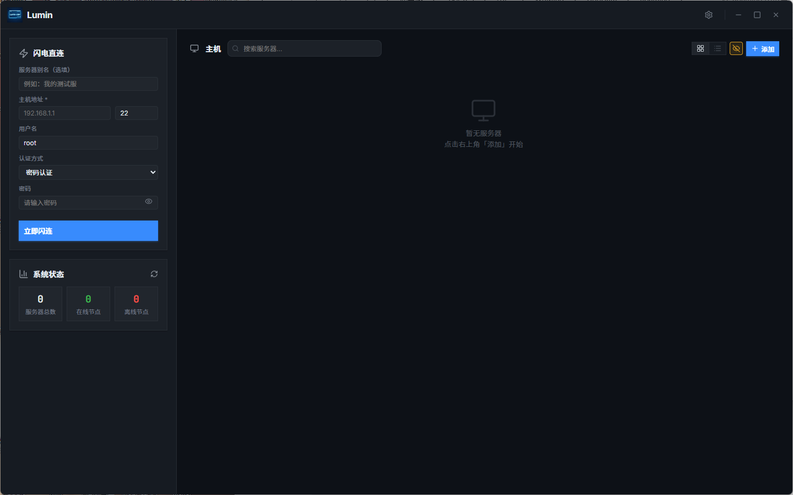
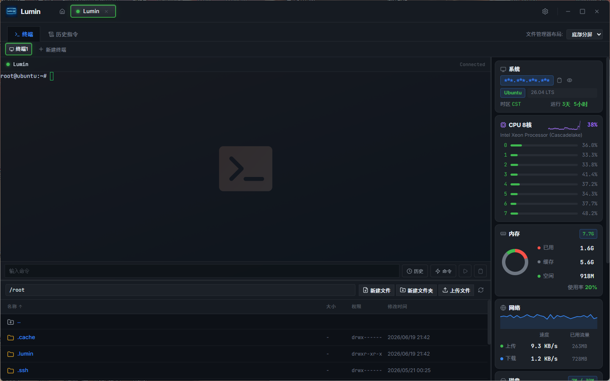

<div align="center">

# Lumin

**轻量、高速、全平台 SSH 客户端**

[](https://github.com/wmwlwmwl/Lumin-SSH/releases)
[](https://github.com/wmwlwmwl/Lumin-SSH/releases)
[](LICENSE)

[English](./README_EN.md) · [简体中文](./README.md)

</div>

---

## 概述

> **Android 客户端**（独立仓库、分开发版）：[Lumin-SSH-Android](https://github.com/wmwlwmwl/Lumin-SSH-Android) · [发行版](https://github.com/wmwlwmwl/Lumin-SSH-Android/releases)

Lumin 是一款面向开发者和运维人员的桌面 SSH 客户端。基于 Go 原生并发 + WebSocket + xterm.js 构建，提供低延迟终端体验。内置系统资源探针、远程文件管理器（含外置编辑器）、命令历史与智能补全、连接级代理、可选加密云同步、AI 对话与 MCP 集成等功能，无需在服务器上安装任何 Agent。

<div align="center">
  
  <br /><br />
  
</div>

---

## 核心功能

### 终端与连接
- **原生级全异步 PTY 引擎** — 基于 Go 原生并发处理 I/O，WebSocket + xterm.js 构建极低延迟通道
- **预测本地回显 (Predictive Local Echo)** — 高延迟网络下也能提供丝滑输入体验
- **多终端标签页** — 一个 SSH 会话内可打开多个独立终端标签页，支持关闭
- **会话管理** — 支持同时管理多个 SSH 会话，标签页右键菜单可断开/关闭/重连
- **终端链接** — 终端中的 URL 可点击，通过系统浏览器打开
- **终端时间戳** — 可选在每行输出前显示时间戳（基于 xterm marker，随 scrollback 同步）
- **敏感信息隐藏** — 一键隐藏/显示密码、密钥等敏感信息

### 仪表盘 (Dashboard)
- **内联服务器编辑** — 左侧常驻添加/编辑表单，可直接保存或「保存并连接」
- **卡片/表格双视图** — 服务器列表支持网格卡片和表格两种视图
- **搜索过滤** — 实时搜索服务器名称、主机、标签等
- **智能延迟检测** — 支持 **SSH Banner RTT**（可穿透 TUN 代理，推荐配合 Clash/V2Ray 使用）和 **TCP Dial** 两种协议
- **可配置 Ping 自动刷新** — 延迟检测间隔可自定义，亦可关闭
- **标签溢出下拉** — 服务器标签过多时自动收起为下拉列表，支持搜索过滤

### 服务器管理
- **保存并连接** — 添加服务器时可一键保存配置并立即建立 SSH 会话
- **克隆服务器** — 右键服务器可一键克隆，拷贝所有配置（含密码/密钥）
- **导入/导出** — 主机列表工具栏的数据管理入口支持导出全部或部分节点（含引用凭据与代理节点）为 **明文 JSON** 或 **密文 .lumin2**；密文导出可复用恢复密码或用自定义密码加密；导入时智能识别明文 JSON 与 `.lumin2`，失败则提示输入密码；提供导入模板下载，方便批量录入与跨机器迁移
- **重复检测** — 添加/编辑/克隆时自动检测 host+port+username 重复并阻止
- **分组管理** — 支持服务器分组、移动分组、按组过滤
- **操作系统图标识别** — 自动识别 Ubuntu、Debian、CentOS、RHEL、Rocky、Alma、Fedora、Arch、NixOS、Alpine、openEuler、TencentOS、Windows、macOS 等主流系统与角色标签
- **凭据管理** — 集中管理可复用的用户名/密码/私钥认证凭据，修改后自动生效于所有引用的服务器
- **连接级代理** — 每台服务器可配置直连、引用代理节点，或自定义 SOCKS5 / HTTP 代理
- **初始路径** — 可为终端与文件管理器分别配置初始目录

### 系统资源探针
- **零 Agent 部署** — 直连后自动挂载监控面板，无需在服务器上安装任何软件
- **实时指标** — CPU 每核心实时曲线、内存甜甜圈图、网络吞吐折线图、磁盘分区挂载表
- **GPU 与 RAID 支持** — 额外支持显卡和磁盘阵列信息查询
- **进程管理** — 实时查看和终止进程，支持搜索、排序、信号发送；可在设置中开启终止确认
- **网络监控详情** — 查看服务器活动连接、流量统计等网络明细
- **可配置刷新间隔** — 探针数据刷新频率可在设置中调整
- **面板位置** — 探针面板支持左侧 / 右侧摆放

### 远程文件管理器
- **完整文件操作** — 浏览、上传、下载、删除、重命名、新建目录/文件、复制/移动
- **内置代码编辑器** — 直接编辑远程文件，支持语法高亮（最大 5MB）
- **外置编辑器** — 用系统默认编辑器或指定本地编辑器打开远程文件；本地保存后自动回传远端（fsnotify 监听 + 防抖去重，最大 5MB）；记忆上次使用的编辑器路径
- **压缩/解压** — 支持 tar.gz / zip 格式
- **压缩传输** — 多文件上传时本机打包为 tar.gz，上传后远端自动解压
- **分块上传** — 大文件分块上传，可配置块大小、并发文件数、每文件并发块数与全局在途上限
- **传输队列** — 上传/下载任务队列面板，可配置发起任务时自动展开
- **下载冲突策略** — 可配置询问/覆盖/跳过/重命名，以及按大小/修改时间判定差异
- **文件权限 (chmod) / 所有者 (chown)** — 可视化权限编辑、八进制设置、递归选项；支持修改所有者与属组
- **跟随终端目录** — 终端 `cd` 后文件管理器可自动同步路径
- **拖拽上传** — 支持从本地拖拽文件到面板上传
- **右键复制路径** — 文件和文件夹均支持右键复制完整远程路径
- **三种布局模式** — 支持标签页、右侧分屏、底部分屏任意切换

### 命令历史、补全与快捷指令
- **自动捕获** — 终端中手工输入、粘贴并回车执行的完整指令自动留存到服务器数据库
- **搜索与回放** — 按服务器或全局搜索历史命令，一键重发
- **智能命令补全** — 汇总服务器历史、全局历史、快捷指令、常用内置命令和远端路径，输入时即时推荐
- **快捷指令库** — 支持分组管理命令片段，一键发送到当前或全部会话
- **动态参数** — 命令中支持插入 `p#` 动态参数，执行时弹窗填入

### 凭据管理
- **集中认证管理** — 创建可复用的密码/私钥凭据组，关联到多台服务器
- **自动同步更新** — 修改凭据后自动在所有引用的服务器上生效
- **私钥密码短语** — 支持配置私钥密码短语（可选留空）

### 代理节点
- **集中节点管理** — 在设置 → 网络中维护 SOCKS5 / HTTP 代理节点列表
- **连接引用** — 服务器可引用代理节点，也可单独写自定义代理
- **AI 请求代理** — AI API 请求可选用指定代理节点
- **导入导出联动** — 节点导出时会带上被引用的代理节点

### AI 对话与代理集成
- **内置 AI 对话面板** — 应用内集成 AI 聊天界面，支持多轮对话、消息编辑/重试/复制、流式输出与推理过程展示
- **多供应商支持** — 兼容 OpenAI API 格式的多种协议（Compatible / Messages / Responses），并提供内置 Kimi 接入
- **内置 Kimi** — 依赖本地 `uv` 运行时环境（设置 → 运行环境可安装），支持初始化与登录流程
- **恶魔模式** — 面向特定供应商渠道的专用会话风格（需 Token 分组校验通过）
- **提示词缓存** — 支持按供应商选择模型默认、关闭、5 分钟或 1 小时缓存策略
- **联网搜索** — 支持供应商原生 web search / 专用搜索配置
- **斜杠命令与 @提及** — 输入 `/` 触发自定义命令，输入 `@` 引用终端输出或远端文件目录
- **工具审批与执行** — AI 调用工具时展示审批卡片，支持逐项批准/拒绝、继续/终止和终端重新指派，自动批准可配置（读取/写入/执行）
- **变更审阅** — 远程编辑类工具提供 diff / patch 审阅工作台
- **智能上下文压缩** — 对话过长时可一键压缩 Token，节省上下文空间
- **对话备份与恢复** — 自动/手动备份对话历史，支持列表、预览与一键还原
- **内置 MCP 服务** — 可在 AI 面板设置中启用的 Streamable HTTP MCP 服务器，为外部 AI 工具提供 SSH 会话访问能力
- **MCP 客户端管理** — 支持添加外部 MCP 服务器（**stdio / SSE / Streamable HTTP**），查看工具与资源，并进行启停、重载、重启、删除和超时配置
- **AI 代理面板** — 会话页显示 AI 工具配置面板，展示 MCP 服务地址、可用工具列表、连接指引
- **可见性控制** — 可在会话页一键展开/收起 AI 助手面板（默认开启，偏好会记住）
- **终端隔离** — 支持为每个终端创建独立的 AI 面板与运行期会话
- **AI 命令终端指派** — 聊天命令可指定发送到哪个终端，终端页展示候选状态与就绪标识
- **终端输出控制** — 可限制 MCP 读取终端输出的最大行数和字符数
- **零配置接入** — AI 编辑器（如 Windsurf、Cursor、VS Code + Copilot 等）通过 MCP 客户端配置即可接入

#### 内置 MCP 工具（节选）
`list_connected_sessions` · `get_work_path` · `list_files` · `read_file` · `write_to_file` · `transfer_batch` · `transfer_list` · `execute_command` · `ask_followup_question` · `attempt_completion` · `search_replace` · `apply_diff` · `apply_patch` · `edit_file`

### 全时云端漫游
- **四种云存储后端** — 支持 **WebDAV**、**Cloudflare R2 (S3 兼容)**、**FTP**、**SFTP**
- **可选加密备份** — 设置恢复密码后生成 `.lumin2`（LUMIN2）密文备份；未设置时使用便于迁移的 `.json` 快照（已移除旧版 `.enc` 兼容）
- **多端一键恢复** — 在新设备上配置同步后端后即可恢复服务器、凭据、快捷指令、AI 配置、代理节点等数据
- **智能合并** — 根据各项数据的更新时间自动合并，并传播删除墓碑，降低多设备覆盖风险
- **多云合并同步** — 选择“全部”时会先汇总所有已配置云端，再把最终结果回写到所有已配置云端
- **自动同步开关与模式** — 可独立开启/关闭自动同步，并指定 WebDAV / R2 / FTP / SFTP / 全部模式
- **保留份数** — 可配置备份保留份数，避免无限堆积

### 本地高强度加密
- 首次运行自动生成 32 字节随机 AES 密钥
- 所有密码、私钥、令牌凭据均经 AES-GCM 加密后落盘

### 自动更新
- 启动时自动检测 GitHub Release（延迟 2.5s，不阻塞启动）
- 设置页支持手动检查更新
- **优先镜像下载** — 可开启多镜像地址下载 GitHub 更新，失败自动回退官方直连
- 实时下载进度 + SHA256 文件校验
- 校验通过后热替换可执行文件并自动重启

### 系统托盘
- 关闭窗口可选择 **最小化到托盘**、**直接退出** 或 **每次询问**
- 单实例保护，重复启动自动唤起已有窗口
- 托盘图标左键显示窗口，右键弹出菜单（显示主窗口 / 完全退出）

### 操作确认与安全
- **操作确认弹窗** — 关闭连接、关闭全部、删除文件、终止进程、关闭窗口均支持二次确认
- **"不再询问" / 独立开关** — 各确认项可在设置中独立开关
- **主机密钥验证** — 首次连接的主机密钥指纹确认 + 密钥变更检测防中间人攻击
- **并发连接进度** — 连接过程可视化卡片，支持同时显示多个并发连接的进度

### 视觉与主题
- **深色/浅色双主题** — 支持跟随系统自动切换
- **极简紧凑界面** — 中性蓝灰色调，统一按钮、标签、表格与弹窗样式
- **四套终端配色方案** — Lumin Default、Tokyo Night、Catppuccin、Dracula（各含深色/浅色变体）
- **字体管理器** — 支持导入、搜索、删除 `.ttf` / `.otf` / `.ttc` / `.woff` / `.woff2`，可分别应用于界面、终端和 AI 面板
- **自定义终端壁纸** — 支持上传图片作为终端背景，可调节透明度
- **主题快捷入口** — 可在标题栏显示主题快速切换入口
- **轻量动效** — 菜单、弹窗与状态变化保留克制过渡，不使用厚重装饰效果
- **Toast 通知** — 操作结果通过非侵入式紧凑 Toast 提示

### 布局与分屏
- **左侧分屏/底部分屏** — 两种分屏模式，可自由拖拽调整大小
- **探针面板宽度与位置可调** — 监控面板支持拖拽调节宽度，并可选左侧/右侧
- **AI 面板宽度可调** — AI 代理面板支持拖拽调节宽度
- **布局偏好持久化** — 所有布局设置实时保存到本地存储

### 快捷键与个性化
- **自定义快捷键** — 复制、粘贴、清屏、新建标签页、SIGINT、EOF、SIGTSTP、清空输入行均支持自由绑定
- **终端字体大小** — 滑块实时调节
- **终端输入回显** — 支持关闭回显以保护输入敏感内容
- **国际化** — 内置 **28** 种语言和地区选项，可即时切换并自动回退简体中文

### 工作区记忆
- **记住窗口大小** — 启动时自动恢复上次关闭时的窗口尺寸与最大化状态
- **记住会话布局** — 可选自动恢复上次的连接、终端标签和分屏布局
- **持久化级别** — **程序级**（全局恢复）或 **会话级**（每个服务器单独保存最近会话，重连时优先恢复）
- **自适应屏幕** — 根据屏幕分辨率自动调整初始窗口大小（留 10% 边距）

### 运行环境
- **uv 运行时** — 设置 → 运行环境可安装/检测 `uv`，供内置 Kimi 与部分 MCP 依赖使用

---

## 快速开始

### 首次使用
1. 从 [Releases](https://github.com/wmwlwmwl/Lumin-SSH/releases) 下载最新版 `Lumin.exe`（或其他平台构建）
2. 双击运行 — 配置目录自动创建在 `%APPDATA%\Lumin\config\`（macOS / Linux 路径见下表）
3. 在仪表盘左侧填写主机、端口、用户名、密码/密钥等，点击 **保存** 或 **保存并连接**
4. 亦可从主机列表点 **添加**，补充分组、代理、初始路径等配置后保存

### 日常操作
- **连接服务器** — 双击服务器卡片，或右键 → 连接
- **多标签终端** — 会话内点击标签栏 `+` 号新建独立终端标签页
- **系统探针** — 点击侧栏 **探针** 面板查看实时 CPU、内存、磁盘、网络指标
- **文件管理** — 点击侧栏 **文件** 面板浏览、上传、下载、编辑远程文件；在内置编辑器中可一键用系统/指定外部编辑器打开并自动回传
- **快捷指令** — 在快捷指令面板中保存常用命令，一键发送
- **克隆服务器** — 右键任意服务器 → 克隆，复制包含密码/密钥在内的全部配置
- **凭据管理** — 在仪表盘 → 凭据管理中创建可复用凭据，跨服务器关联引用
- **代理节点** — 在设置 → 网络中维护代理节点，并在服务器表单中引用

---

## 配置与数据

### 数据存储路径

首次运行自动在用户配置目录下创建 `Lumin/config/` 文件夹：

| 平台 | 路径 |
|------|------|
| Windows | `%APPDATA%\Lumin\config\` |
| macOS | `~/Library/Application Support/Lumin/config/` |
| Linux | `~/.config/Lumin/config/` |

### 主要文件

| 文件 | 用途 |
|------|------|
| `lumin.key` | 32 字节 AES 加密密钥（首次运行时自动生成） |
| `connections.json` | 服务器连接配置（AES-GCM 加密存储密码/密钥） |
| `credentials.json` | 凭据管理数据 |
| `webdav.json` | WebDAV / R2 / FTP / SFTP 同步配置 |
| `quick_commands.json` | 快捷指令库数据 |
| `param_history.json` | 动态参数历史记录 |
| `history/` | 每个服务器的命令历史 |
| `sync_mode.json` | 自动同步模式配置 |
| `auto_sync_enabled.json` | 自动同步开关状态 |
| `last_sync_time` | 上次同步时间戳 |
| `snapshot_time` | 快照时间戳 |
| `ai_global_settings.json` | AI 全局设置（供应商选择、自动批准、斜杠命令、请求代理等，含 `updatedAt`） |
| `ai_providers.json` | AI 供应商配置列表（逐项 `updatedAt`） |
| `proxy_nodes.json` | 代理节点管理数据（逐项 `updatedAt`） |
| `tasks/` | AI 对话存储（每对话一个子目录，含元数据、消息、设置、备份） |

---

## 自动更新机制

Lumin 采用 GitHub Releases 作为更新分发渠道，全流程如下：

1. **版本检测** — 启动时及设置页中调用 GitHub API 获取最新 Release 信息
2. **语义化比较** — 自动对比本地版本与最新版本
3. **资源匹配** — 根据当前运行版本（便携版/安装版）自动匹配对应的可执行文件
4. **安全下载** — 强制 HTTPS；可优先走镜像，失败回退官方；实时推送下载进度
5. **完整性校验** — SHA256 校验，防止文件篡改
6. **热替换重启** — 校验通过后替换当前可执行文件并自动重启

> 版本号统一管理：`wails.json`（构建）、`frontend/src/config.js`（前端）、`frontend/package.json`（npm）三者保持一致。当前开发线为 **1.2.0.1**。

---

## 配置界面

Lumin 提供丰富的设置面板，通过标签页分类管理：

| 标签页 | 功能 |
|--------|------|
| **通用** | 界面语言、操作确认（关连接/关全部/删文件/杀进程）、关闭窗口行为、工作区记忆与持久化级别、更新镜像下载、WebView GPU 硬件加速开关 |
| **网络** | 延迟检测协议（SSH Banner RTT / TCP Dial）与开关、探针与延迟刷新间隔、代理节点管理 |
| **文件管理器** | 跟随终端目录、压缩传输、传输队列、目录图标、chmod 默认策略、初始/新标签路径、下载保存与冲突策略、上传并发与分块参数 |
| **运行环境** | 安装/检测 `uv` 等运行时依赖（内置 Kimi / 部分 MCP 需要） |
| **外观** | 字体管理器、终端字体大小、输入回显、时间戳、终端颜色主题、界面主题、主题快捷入口、探针位置、终端壁纸、窗口尺寸记忆 |
| **快捷键** | 所有终端操作快捷键的自由绑定 |
| **同步与云** | WebDAV / R2 / FTP / SFTP、恢复密码、备份保留与自动同步策略 |
| **关于** | 版本信息、检查更新、社区链接 |

> AI 相关配置（供应商、模型、工具审批、MCP 服务与外部 MCP 客户端、对话备份等）在 **AI 面板设置** 中管理，不占用设置弹窗标签页。

---

## 构建指南

### 环境要求
- **Go 1.26+**（与 `go.mod` 一致）
- **Node.js 18+**
- **Wails CLI**（项目基于 Wails v2）

### 安装与构建

```bash
# 安装 Wails CLI
go install github.com/wailsapp/wails/v2/cmd/wails@latest

# 克隆仓库
git clone https://github.com/wmwlwmwl/Lumin-SSH.git
cd Lumin-SSH

# 生产构建（便携版）
wails build

# 构建 NSIS 安装包（Windows，需安装 NSIS）
wails build -nsis
```

### 构建产物

- 便携版：`build/bin/Lumin.exe`（Windows）
- 安装包：`build/bin/Lumin-amd64-installer.exe`（Windows NSIS）

---

## 注意事项

### 安全相关
- **AES 密钥备份** — `lumin.key` 是主密钥，一旦丢失所有加密数据（密码、私钥）将无法恢复，请务必备份
- **WebSocket 鉴权** — 终端 WebSocket 连接使用随机 32 字节令牌 + 严格 Origin 头校验（`wails://wails`），防止未授权本地访问
- **主机密钥验证** — 首次连接时请仔细核对主机密钥指纹，Lumin 会自动检测密钥变更以防止中间人攻击

### 操作相关
- **单实例保护** — Lumin 仅允许运行一个实例，重复启动会自动唤起已有窗口
- **关闭窗口行为** — 可在设置 → 通用中配置关闭窗口时的行为：每次询问、直接退出、最小化到托盘
- **同步冲突处理** — 多设备同步时自动合并策略会处理冲突，可在设置 → 同步与云中查看同步模式
- **外置编辑** — 始终先打开内置编辑器，再由用户触发外置；编辑器进程结束不是同步条件，以文件变更监听为准

### MCP / AI 集成
- **服务开关** — MCP 服务默认关闭，可在 AI 面板设置中按需启用
- **浏览器调用控制** — 可控制是否允许带 Origin 的浏览器请求访问本地 MCP 服务（降低误暴露面，并非防同用户恶意进程的强安全边界）
- **固定本地端口** — MCP 服务器绑定在 `127.0.0.1:5779`，请确保该端口未被占用
- **仅本地访问** — MCP 服务仅监听 localhost，AI 编辑器需运行在同一台机器上
- **运行环境** — 内置 Kimi 等能力需要先安装 `uv`（设置 → 运行环境）

---

## 常见问题 (FAQ)

### 密码/密钥如何加密存储？

首次运行时自动生成 32 字节随机 AES 密钥，保存到 `lumin.key`。所有密码、私钥、凭据均使用 AES-256-GCM 加密后落盘。

### 如何同步配置到多台电脑？

设置 → 同步与云 → 配置 WebDAV / R2 / FTP / SFTP 任一后端。需要密文备份时请先设置恢复密码，Lumin 会生成 `.lumin2` 快照；未设置恢复密码时同步 `.json` 快照。在新设备上配置同一后端即可恢复。

### 克隆服务器会复制密码吗？

会。克隆通过后端 API 获取解密后的真实密码/密钥数据，克隆后的服务器配置（含密码、私钥、凭据引用、代理配置）与原服务器完全一致，无需重新输入。

### 凭据管理和直接使用用户名密码有什么区别？

凭据管理将认证配置（用户名/密码/私钥）抽取为独立实体，可关联到多台服务器。修改凭据后所有引用该凭据的服务器自动生效，无需逐台编辑。适合多台服务器使用相同认证信息的管理场景。

### 如何用 VS Code / Notepad++ 等编辑远程文件？

在文件管理器中打开文件 → 内置编辑器 → **使用系统编辑器** 或 **用…编辑**（可记忆路径）。本地保存后 Lumin 自动检测变更并回写远端。

### AI 代理面板如何使用？

Lumin 内置 MCP (Model Context Protocol) 服务器，默认关闭，可在 AI 面板设置中启用。启用后监听 `127.0.0.1:5779`，AI 编辑器（Windsurf、Cursor、Copilot 等）通过 MCP 客户端配置即可连接，AI 可以读取终端输出、执行命令、读写远程文件。还可控制是否允许浏览器调用及终端输出范围。

### 支持哪些操作系统？

支持 Windows、macOS、Linux 三大平台，各平台原生构建均已通过测试。

### 窗口关闭行为如何设置？

设置 → 通用 → 关闭窗口时，支持三种选择：
- **每次询问** — 关闭窗口时弹窗询问退出或最小化到托盘
- **直接退出** — 点击关闭直接退出应用
- **最小化到托盘** — 点击关闭最小化到系统托盘

---

## 赞助支持

如果你觉得 Lumin 对你有帮助，欢迎扫码赞助支持，你的每一份鼓励都是持续更新的动力。

<div align="center">
  <table>
    <tr>
      <td align="center">
        
        <br/>
        <strong>微信</strong>
      </td>
      <td align="center">
        
        <br/>
        <strong>支付宝</strong>
      </td>
      <td align="center">
        
        <br/>
        <strong>QQ</strong>
      </td>
    </tr>
  </table>
</div>

---

## 贡献指南

欢迎任何形式的贡献！你可以通过以下方式参与：

- **报告 Bug** — 通过 [GitHub Issues](https://github.com/wmwlwmwl/Lumin-SSH/issues/new) 提交
- **代码贡献** — Fork 仓库，提交 PR
  - 遵循现有代码风格和命名约定
  - 非阻塞操作使用异步模式

---

## 许可证

本项目采用 [Lumin SSH Source License 1.1](LICENSE)（与 Android 端一致）：

| | |
|--|--|
| **可以** | 非商业使用、学习、研究、公开二开（保留许可与署名；对外发布须源码可得） |
| **不可以** | 商用 |
| **不可以** | 仅以加密/加壳/强混淆形式对外发布且不提供对应可读源码 |

第三方依赖仍遵循其各自许可证。本许可证**不构成法律意见**。

> 桌面端与 Android 端**分仓分开发版**；本仓库 Release **仅 Desktop**，Android 见 [Lumin-SSH-Android](https://github.com/wmwlwmwl/Lumin-SSH-Android)。
