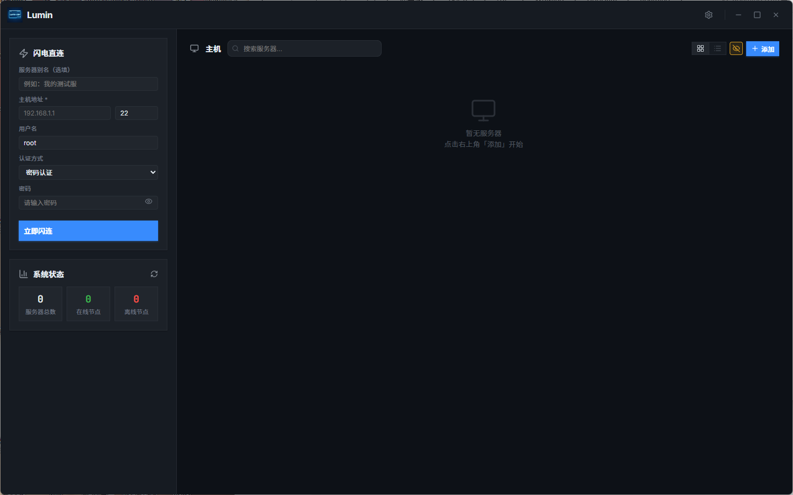
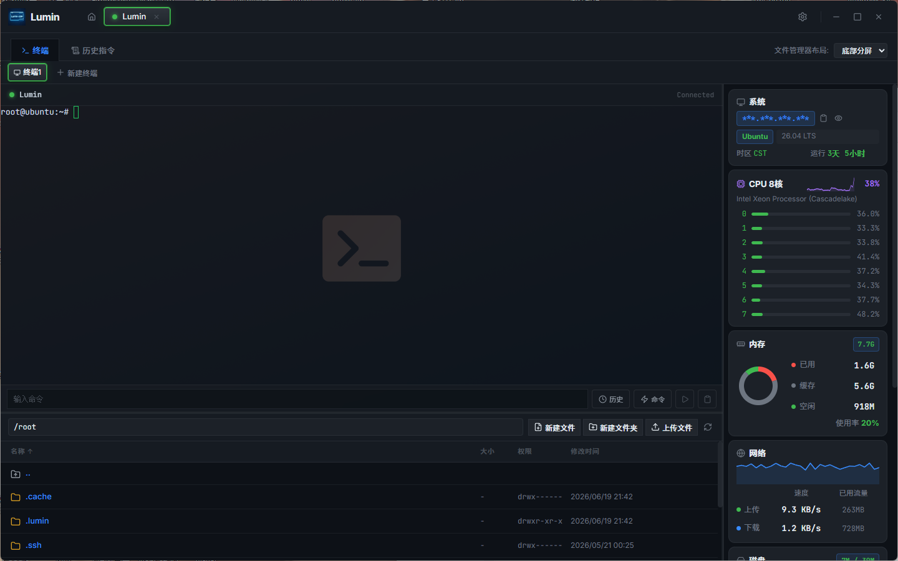
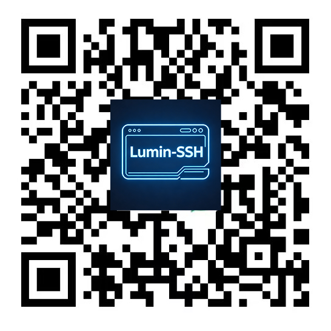

<div align="center">

# Lumin

**Lightweight, high-performance, cross-platform SSH client**

[](https://github.com/wmwlwmwl/Lumin-SSH/releases)
[](https://github.com/wmwlwmwl/Lumin-SSH/releases)
[](LICENSE)

[English](./README_EN.md) · [简体中文](./README.md)

</div>

---

## Overview

> **Android client** (separate repository, independently released): [Lumin-SSH-Android](https://github.com/wmwlwmwl/Lumin-SSH-Android) · [Releases](https://github.com/wmwlwmwl/Lumin-SSH-Android/releases)

Lumin is a desktop SSH client for developers and operations teams. Built on **native Go concurrency + local WebSocket + xterm.js**, it provides a low-latency terminal experience inside a Wails desktop shell. It includes a system resource probe, remote file manager (with built-in/external editors), command history and intelligent completion, per-connection proxies, optional encrypted cloud sync, AI chat, and MCP integration — **with no Agent required on the server**.

<div align="center">
  
  <br /><br />
  
</div>

---

## Core features

### Terminal and connections
- **Native-grade asynchronous PTY** — Go handles I/O concurrently; terminal traffic uses a local loopback WebSocket (random port + session-level token + Origin validation) instead of the Wails IPC hot path
- **Predictive local echo** — typing remains responsive on high-latency networks
- **Multiple terminal tabs** — open multiple independent terminal tabs within one SSH connection
- **Multiple sessions** — maintain sessions to multiple servers at once; tab context menu: disconnect / close / reconnect
- **Local and serial terminals** — Windows supports PowerShell, CMD, and installed WSL distributions; macOS/Linux supports local shells; serial devices can also be connected directly. WSL/Unix local sessions support the file manager and resource probe, native Windows shells support the local file manager but not the resource probe, and serial sessions provide the terminal only
- **Terminal encoding** — each server can select UTF-8, GB18030/GBK/Big5, Japanese/Korean encodings, Windows/ISO-8859, IBM/OEM, and other encodings independently, with bidirectional input/output conversion
- **SSH channel usage** — session tabs show the combined count of terminal, shared-file, and upload channels, with a warning when approaching the server limit
- **Collapsible command blocks** — optionally show command-block borders on the left side of the terminal; click to collapse output for easier browsing of long logs
- **Terminal links** — URLs can be clicked to open in the system browser
- **Terminal timestamps** — optionally show a timestamp at the start of each line (xterm marker, synchronized with scrollback)
- **Sensitive information masking** — hide or show passwords, keys, and other sensitive information with one click
- **Session-level shell hook (bash)** — when connecting to bash, injects a session-level `PROMPT_COMMAND` to collect command history and CWD (without writing to `.bashrc`); used by the history panel, AI, and completion. Also supports OSC 733 for CWD tracking in zsh/fish and other non-bash shells
- **Port forwarding** — SSH local/remote port forwarding with create, edit, delete, and query operations; persisted per session and automatically reclaimed on disconnect

### Dashboard
- **Inline server editing** — the add/edit form stays in the left sidebar, with **Save** and **Save and connect** options
- **Card / table views** — switch between grid cards and table layouts
- **Search and filtering** — filter servers in real time by name, host, tags, and more
- **Smart latency detection** — **SSH Banner RTT** (can pass through some TUN/proxy scenarios) and **TCP Dial**; configurable interval or disabled; Banner mode uses a more conservative minimum refresh interval to reduce false alerts from security devices
- **Tag overflow dropdown** — excessive tags collapse into a searchable dropdown

### Server management
- **Save and connect** — connect immediately after adding a server
- **Clone servers** — clone the configuration, including passwords, keys, credential references, and proxy settings
- **Import / export** — export all or selected nodes (including referenced credentials and proxy nodes) as **plaintext JSON** or encrypted **`.lumin2`**; encrypted files can reuse the recovery password or use a custom password; imports automatically detect JSON / `.lumin2`; import templates are provided
- **Duplicate detection** — blocks duplicates with the same host + port + username
- **Groups** — organize servers into groups, move servers, and filter by group
- **Operating-system icons** — automatically recognizes Ubuntu, Debian, CentOS, RHEL, Rocky, Alma, Fedora, Arch, NixOS, Alpine, Kali, Gentoo, openSUSE, openEuler, OpenCloudOS, Anolis, TencentOS, Alibaba, AOSC, Oracle, FreeBSD, Windows, macOS, and more; icon assets are in `frontend/public/`
- **Credential management** — reuse usernames, passwords, private keys, and other credentials; changes take effect automatically wherever they are referenced
- **Per-connection proxy** — direct connection, a referenced proxy node, or a custom SOCKS5 / HTTP proxy
- **Initial paths** — configure separate initial directories for the terminal and file manager

### System resource probe
- **Zero Agent** — deploys monitoring scripts such as `~/.lumin/probe.sh` on demand after connection; no resident service is required
- **Real-time metrics** — per-core CPU, memory, network throughput, disk partitions, and more
- **GPU / RAID** — additional information when supported by the environment
- **Process management** — view, search, sort, and signal processes; termination confirmation can be enabled
- **Network details** — active connections and traffic-related views
- **Refresh interval and panel position** — configurable; the probe can be placed on the left or right

### Remote file manager
- **Complete file operations** — browse, upload, download, delete, rename, create, copy, and move files
- **Clipboard** — right-click to copy / cut / paste remote paths within a session
- **Built-in editor** — edit remote files with syntax highlighting (approximately 5 MB size limit)
- **External editor** — use the system default or a specified local editor; automatically uploads changes after local saves (fsnotify + debounce, approximately 5 MB limit); remembers the editor path
- **Compress / extract** — tar.gz and other formats; double-click extraction can be enabled or disabled in Settings
- **Compressed transfer** — package multiple local files into a tar.gz archive, upload it, then extract it remotely
- **Chunked upload** — configure chunk size, maximum concurrent files, per-file chunk concurrency, and the global in-flight limit
- **Transfer queue** — upload/download queue panel; transfer-channel concurrency and reuse are optimized
- **Large-directory performance** — virtualized file-list rendering avoids creating all rows at once for large directories
- **File locator** — locate names in the current directory, move to the previous/next match, and navigate with the keyboard
- **Type detection and refresh** — correctly distinguish directories from symbolic links; automatically refresh the current directory after terminal commands finish or when the panel regains focus
- **Download conflict policies** — ask / overwrite / skip / rename; determine conflicts by size and modification time
- **chmod / chown** — graphical permissions and owner controls
- **Follow terminal directory** — synchronize the path after `cd` in the terminal
- **Drag-and-drop upload** — drag local files into the panel
- **Copy remote path** — right-click to copy the complete path
- **Layouts**
  - Workspace docking: **tabs / right split / bottom split**
  - File list: **top tabs with a single pane** or **left tabs with dual panes** (history tabs plus left/right lists)

### Command history, completion, and quick commands
- **Automatic capture** — commands executed by pressing Enter are written to the local history database (per server / global)
- **Search and replay** — resend a command after searching
- **Intelligent completion** — combines server history, global history, quick commands, common commands, and remote paths
- **Quick-command library** — manage groups; send commands to the current session or all sessions
- **Pinned command bar** — keep quick commands above the terminal input area; click a command and confirm before sending
- **Dynamic parameters** — `p#` placeholders prompt for values at execution time

### Credentials and proxy nodes
- **Credentials** — centrally manage passwords, private keys, and passphrases; reuse them across servers
- **Proxy nodes** — maintain SOCKS5 / HTTP nodes under Settings → Network; servers can reference them, and AI requests can specify a proxy node
- **Import/export integration** — exporting connections includes referenced proxy nodes

### AI chat and MCP
- **Built-in AI panel** — multi-turn conversations, streaming output, reasoning display, message editing/retry/copy
- **Multiple provider protocols** — Compatible / Messages / Responses
- **Slash commands and @ mentions** — custom `/` commands; reference terminal output or remote paths with `@`
- **Tool approval** — configure automatic approval or per-item confirmation for read/write/execute operations; supports continue/terminate and terminal reassignment
- **Change review** — remote editing tools provide diff / patch / restore workbenches
- **Context compression and conversation backups** — token compression; automatic/manual backup and restore; editable task titles
- **Conversation search** — full-text search across AI conversation history (SQLite FTS5 + CJK fallback)
- **Web search** — Responses API `web_search` tool support; enable per provider or specify a dedicated web-search provider
- **Conversation storage directory** — customize it in AI settings; existing conversations are migrated automatically when it changes
- **Collaboration-related capabilities** — including conversation collaboration takeover (see the AI panel)
- **Terminal isolation** — maintain a relatively independent AI runtime context for each terminal
- **Built-in MCP service (Streamable HTTP)** — enabled by default and listening on `127.0.0.1:5779` (can be disabled in AI settings); **no HTTP token**; relies mainly on loopback + Origin friction (**not** a security boundary against malicious processes running as the same user)
- **External CLI Integration** — External CLIs such as Claude Code and Codex can drive already-connected SSH sessions through the built-in MCP server. All operations leave an audit trail in the **MCP Activity panel** (showing client name, server, invoked tool, command and status). Write-operation approval gating is optional (disabled by default; see [Setup Guide (Chinese only)](./docs/MCP-CLI-GUIDE.md)).
- **MCP client** — add external MCP servers (stdio / SSE / Streamable HTTP), with start/stop, reload, timeout, and other controls
- **Terminal output controls** — limit the number of lines and characters of terminal output exposed to MCP/AI

#### Built-in MCP tools (selection)
`list_connected_sessions` · `get_work_path` · `list_files` · `read_file` · `write_to_file` · `transfer_batch` · `transfer_list` · `execute_command` · `ask_followup_question` · `attempt_completion` · `search_replace` · `apply_diff` · `apply_patch` · `edit_file`

### Cloud sync
- **Backend** — WebDAV, Cloudflare R2 (S3-compatible), FTP, and SFTP (all **user-hosted/owned** endpoints)
- **Snapshot contents** — servers, credentials, quick commands, AI providers and global settings, proxy nodes, and deletion tombstones
- **Encryption strategy**
  - **Recovery password set** → upload **`.lumin2`** (PBKDF2 + AES-GCM)
  - **Not set** → upload **plaintext `.json`** (easy to migrate, but cloud storage can read sensitive fields; use carefully)
- **Merge and tombstones** — merge by timestamps and deletion records to reduce cross-device overwrites; auto-sync can be toggled independently, with single-backend or “all” modes
- **Retention count** — configurable

### Local encryption
- On first run, generates a **32-byte** `lumin.key` (in the config directory, with permissions tightened as much as possible)
- Connection passwords, private keys, passphrases, proxy passwords, credentials, recovery passwords, and some cloud-account keys are encrypted with **AES-256-GCM** before being written to local JSON
- **Note:** AI API keys and some proxy-node files are currently stored as application JSON and are **not all** protected by `lumin.key`; cloud-sync ciphertext depends on the **recovery password**, a separate system from `lumin.key`

### Auto-update
- Checks GitHub Release metadata approximately 2.5 seconds after startup without blocking the first screen
- Settings → About provides a manual check
- Only HTTPS GitHub Release asset download paths are allowed; an optional gh mirror can accelerate downloads
- **Mandatory SHA256** verification before installation/hot replacement (Windows portable version and installer; Linux deb/rpm; macOS dmg + codesign verification, as applicable by platform)

### System tray and single instance
- Closing the window: **ask every time / quit directly / minimize to tray**
- Single instance; a second launch brings the existing window to the foreground
- Left-click shows the tray window; right-click opens the menu; after a long idle period, the app tries to force the window to the foreground where supported by the platform

### Visuals, themes, and layout
- **Dark / light** — optionally follow the system
- **Theme packages** — multiple built-in terminal/UI themes (with light/dark variants); copy themes between light/dark modes; AI-assisted color adjustment is available (color-mode conversations are not saved by default)
- **Font management** — import ttf/otf/ttc/woff/woff2, separately for the UI, terminal, and AI panel
- **Terminal wallpaper** — customize the background and opacity
- **Title-bar theme shortcut** — can be enabled or disabled
- **Splits** — adjust the width/position of the probe, file manager, and AI panels; layout preferences persist
- **Toast** — unobtrusive notifications

### Shortcuts, language, and workspace
- **Custom shortcuts** — copy/paste/clear screen/new tab/signals/clear input line, and more
- **Internationalization** — built-in **28** language/locale packs, with instant switching
- **Workspace memory** — window size and maximized state; optionally restore sessions and splits; persistence can be program-wide or per session

### Runtime environment
- Settings → Runtime environment: install/detect **uv**

---

## Quick start

### First use
1. Download the package for the current platform from [Releases](https://github.com/wmwlwmwl/Lumin-SSH/releases) (Windows portable/installer, Linux deb/rpm, macOS dmg, and more)
2. Run the app; the configuration directory is created automatically (see the table below)
3. Fill in the host information in the left side of the dashboard → **Save** or **Save and connect**
4. Configure proxy nodes, cloud sync, recovery password, AI providers, and other options in Settings as needed

### Daily use
- Double-click a card or right-click to connect; click `+` in a session to open another terminal
- Open the probe / file manager / AI panel from the sidebar
- Access quick commands, credentials, cloning, and import/export from the host list and its related entry points

---

## Configuration and data

### Paths

| Platform | Configuration directory |
|------|----------|
| Windows | `%APPDATA%\Lumin\config\` |
| macOS | `~/Library/Application Support/Lumin/config/` |
| Linux | `~/.config/Lumin/config/` |

### Main files (selection)

| File / directory | Purpose |
|-------------|------|
| `lumin.key` | Local AES master key (generated on first run). **Losing it means locally encrypted fields cannot be decrypted; back it up** |
| `connections.json` | Server list (sensitive fields use AES-GCM) |
| `credentials.json` | Credential store |
| `webdav.json` etc. | Configuration for each sync backend (account keys and other secrets are encrypted) |
| `quick_commands.json` | Quick commands |
| `param_history.json` | Dynamic-parameter history |
| `history/` | Command history |
| `sync_mode.json` / `auto_sync_enabled.json` / `sync_tombstones.json` etc. | Sync mode, auto-sync toggle, timestamps, and deletion tombstones |
| `recovery_password` | Recovery password (encrypted by `lumin.key`) |
| `ai_global_settings.json` | AI global settings (including MCP toggle and automatic approval) |
| `ai_providers.json` | AI provider list (including API keys and other business fields) |
| `proxy_nodes.json` | Proxy nodes |
| `tasks/` | AI conversations and backups (storage directory can be customized in AI settings; the path is recorded in `app_settings.json`) |
| `port_forwards.json` | Port-forwarding records |
| `file_manager_settings.json` | File-manager preferences (double-click extraction, transfer tuning, and more) |
| `app_settings.json` | Application preferences (GPU acceleration, runtime environment, theme packages, AI conversation storage path) |
| `workspace_*.json` | Workspace state, preferences, and session recovery |

> On Windows, the WebView2 user-data directory is fixed at `%APPDATA%\Lumin\`, alongside `config\`; renaming the portable executable does not create multiple browser-data directories.

---

## Auto-update

1. Fetch GitHub Release metadata for `wmwlwmwl/Lumin-SSH`
2. Match an installer or portable package for the platform
3. Download over HTTPS (optionally through a mirror) → **`.sha256` verification** → platform installation or hot replacement

Version numbers are based on `wails.json`, `frontend/src/config.ts`, `frontend/package.json`, and `frontend/package-lock.json`; the current version is **1.2.6**.

---

## Settings interface

| Tab | Contents |
|------|------|
| **General** | Language, operation confirmations, close-window behavior, workspace memory, update mirror, WebView GPU, and more |
| **Network** | Latency protocol and interval, probe refresh, proxy nodes |
| **File manager** | Follow terminal directory, compressed transfer, queue, double-click extraction, layout/tabs, download conflicts, chunked-upload tuning, and more |
| **Runtime environment** | uv installation and detection |
| **Appearance** | Fonts, terminal themes/wallpaper, UI theme packages, probe position, command-block borders, and more |
| **Shortcuts** | Terminal shortcuts |
| **Sync and cloud** | WebDAV / R2 / FTP / SFTP, recovery password, retention count, auto-sync |
| **About** | Version, update check, repository, and community links |

> AI providers, tool approval, the MCP service/client, conversation backups, and related options are in the **AI panel settings**, not the tabs above.

---

## Build

### Environment
- Go **1.26+** (see `go.mod`)
- Node.js 18+
- [Wails v2](https://wails.io/) CLI

### Commands

```bash
go install github.com/wailsapp/wails/v2/cmd/wails@latest
git clone https://github.com/wmwlwmwl/Lumin-SSH.git
cd Lumin-SSH

wails dev            # Start development mode
wails build          # Portable/platform-default output
wails build -nsis    # Windows installer (NSIS required)
```

Common output: `build/bin/Lumin` / `Lumin.exe`; installers and deb/rpm/dmg packages are generated by CI or platform-specific local scripts.

Windows one-click local build (automatically syncs the version, compresses with UPX, and outputs `Lumin-V{version}-portable.exe` and `Lumin-V{version}-amd64-installer.exe`):

```powershell
.\build_release.ps1    # Requires local Go, NSIS, and UPX
```

For official releases (tagging, changelog, and multi-platform packages), see [.github/RELEASE_EN.md](.github/RELEASE_EN.md).

---

## Security and notes

### Important to know
- **Back up `lumin.key`** — it is the local AES master key. Losing it means passwords, private keys, recovery passwords, and other encrypted data on **this machine** cannot be decrypted. A cloud `.lumin2` protected by the recovery password or a plaintext export may still allow recovery from another copy, but the local vault itself will be unusable.
- **Recovery password and plaintext sync** — without a recovery password, cloud sync uses **plaintext JSON** containing server passwords, private keys, AI keys, and more. A strong recovery password is strongly recommended for production environments.
- **Host keys** — verify the fingerprint on the first connection; changes trigger a warning to reduce MITM risk
- **Terminal WebSocket** — restricted to `127.0.0.1`, with a random port, random token, and Origin restrictions
- **MCP** — bound to `127.0.0.1:5779` by default and can be disabled. Without a token, **local processes running as the same user** can theoretically call tools for connected sessions. Do not expose it to the public network, and do not assume it protects against local malware.
- **Update chain** — relies on GitHub Releases and SHA256; if the account or CI is compromised, the hash can be replaced together with the artifact. This is a limitation of the supply-chain trust model.

### Usage habits
- Single instance; tray and close behavior are configured under General
- For external editing, use the built-in editor first, then the external editor; changes are uploaded through file-change monitoring, not when the editor process exits
- Local runtime-related features require the **uv** runtime to be installed first

---

## FAQ

### How are passwords stored?
The local AES-256-GCM key is `lumin.key`. Cloud sync uses a recovery password for `.lumin2`, or plaintext `.json` without one.

### How do I sync across multiple machines?
Go to Settings → Sync and cloud and configure your own WebDAV/R2/FTP/SFTP endpoint. We recommend setting a recovery password before enabling auto-sync.

### Does cloning include the password?
Yes. It uses the same configuration as the original, including keys and credential references.

### What is the difference between credentials and a password written on a server?
A credential is a reusable entity: edit it once and the change takes effect everywhere it is referenced.

### How do I edit a remote file externally?
In the file manager, open the built-in editor and choose the system/default or specified editor. Local saves are automatically uploaded back.

### AI / MCP?
Configure the provider and approval policy in the AI panel. Toggle MCP in AI settings; when enabled, the local MCP client or editor can connect to `127.0.0.1:5779` (see the panel instructions for details).

### Which desktop systems are supported?
Native builds are available for Windows, macOS, and Linux.

---

## Sponsor

If you find Lumin useful, sponsorship is welcome:

<div align="center">
  <table>
    <tr>
      <td align="center">
        
        <br/><strong>WeChat</strong>
      </td>
      <td align="center">
        
        <br/><strong>Alipay</strong>
      </td>
      <td align="center">
        
        <br/><strong>QQ</strong>
      </td>
    </tr>
  </table>
</div>

---

## Contributing

- Bugs: [Issues](https://github.com/wmwlwmwl/Lumin-SSH/issues/new)
- PRs: Fork the repository and submit one; match the existing style where possible; keep I/O and networking non-blocking

---

## License

See [LICENSE](LICENSE) (**Lumin SSH Source License 1.1**, part of the same family as the Android license):

| | |
|--|--|
| **Allowed** | Non-commercial use, study, research, and public derivative works (retain the license and attribution; public distribution must make the source available) |
| **Not allowed** | Commercial use (sale, paid distribution, commercial embedding, for-profit services, and similar activities; see LICENSE for the definition) |
| **Not allowed** | Public distribution only in encrypted, packed, or heavily obfuscated form without providing the corresponding readable source |

**Scope:** This license applies to **original code in this repository**. Third-party dependencies remain subject to their original licenses (this license must not be used to weaken rights granted by those licenses).

This is a custom license, **not formal legal advice**. Consult a lawyer about commercial boundaries.

> The desktop and Android clients are distributed from **separate repositories**; this repository's Releases are **Desktop only**. For Android, see [Lumin-SSH-Android](https://github.com/wmwlwmwl/Lumin-SSH-Android).
